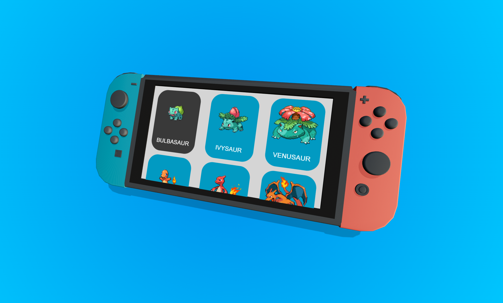
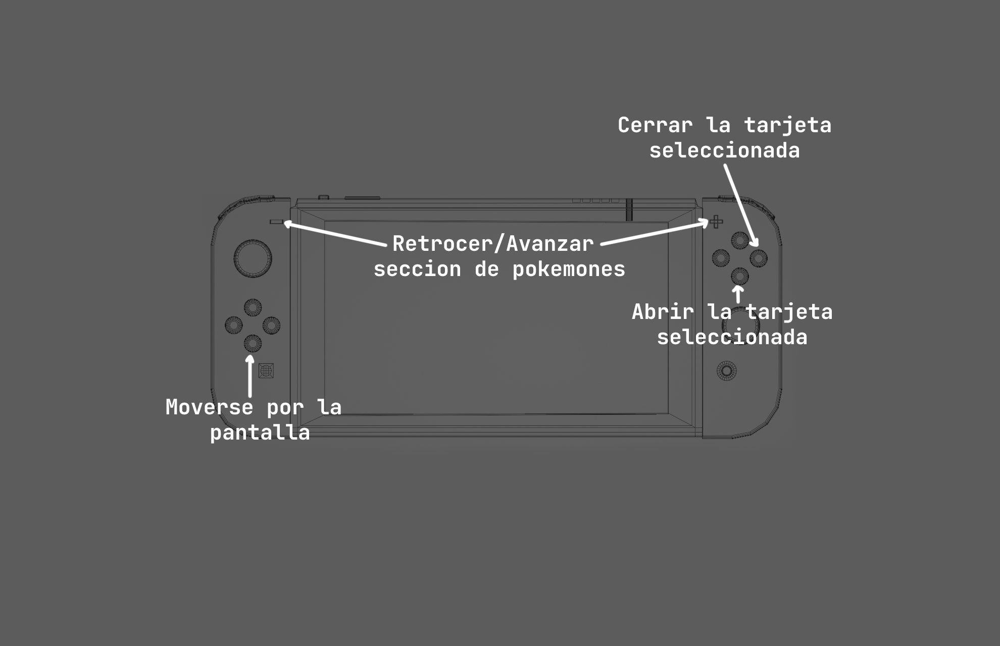

# Pokedex dentro de un Nintendo Switch 

## **Descripción**
Los modelos fueron realizados en Blender, y la aplicación trabaja principalmente con @React-Three-Fiber y React

PD: Se utilizaron bastantes hooks de useState para controlar el llamado a la Poke API y el movimiento del selector de tarjeta dentro de la pantalla de Switch. Redux fue considerador como alternativa a toda esta problematica, sin embargo, Redux es incompatible ([al menos de momento](https://docs.pmnd.rs/react-three-fiber/advanced/gotchas)) con la librería 3D de [@React-Three-Fiber](https://docs.pmnd.rs/react-three-fiber/getting-started/introduction). Mas adelante se hara refactorizacion de codigo utilizando [Zustand](https://github.com/pmndrs/zustand) o bien, utilizando los recursos de @React-Three-Fiber. 

## **Tecnologías && Librerías**
- [@React-Three-Fiber](https://docs.pmnd.rs/react-three-fiber/getting-started/introduction)
 - React  
 - HTML  
 - Styled-Components
 - Axios
 - [Blender](https://www.blender.org/)

## Controles

Solo los botones indicados funcionan 
PD: Posible incompatibilidad con dispositivos de Apple

## Demo 
Firebase Hosting: https://pokedexswitch.web.app/
